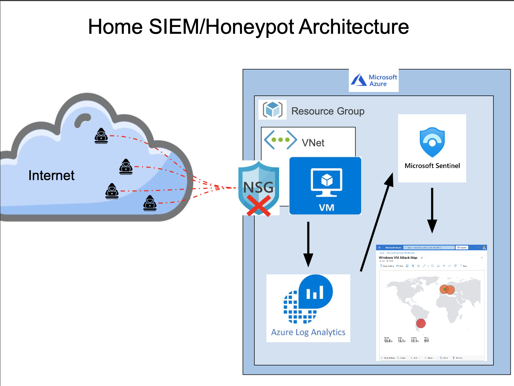
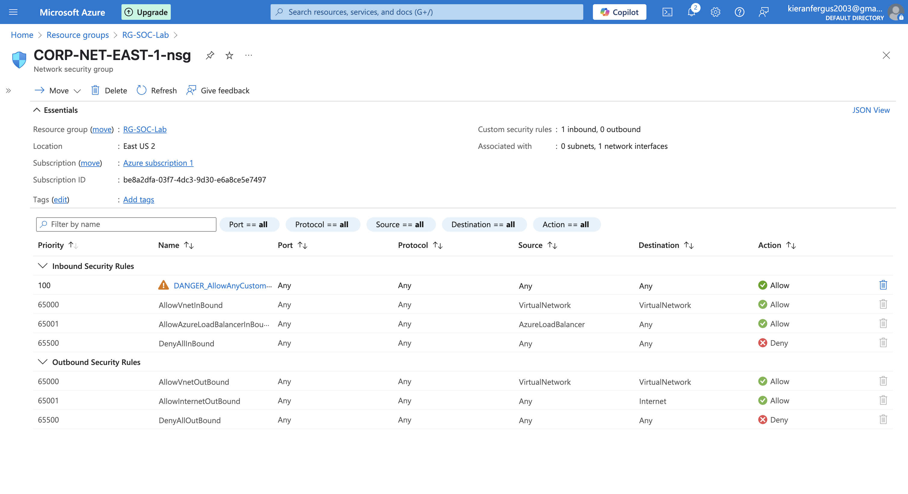
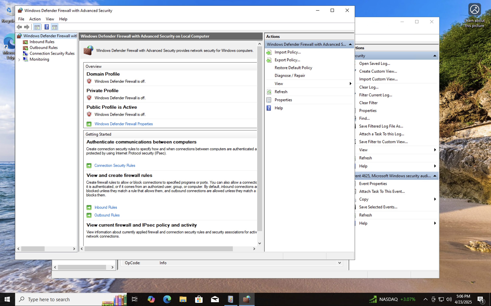
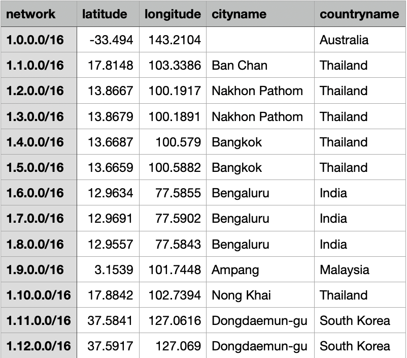
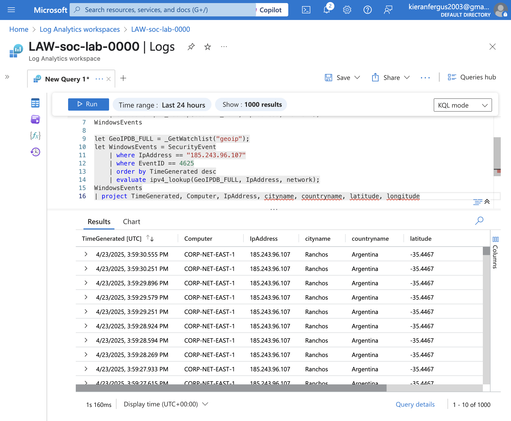
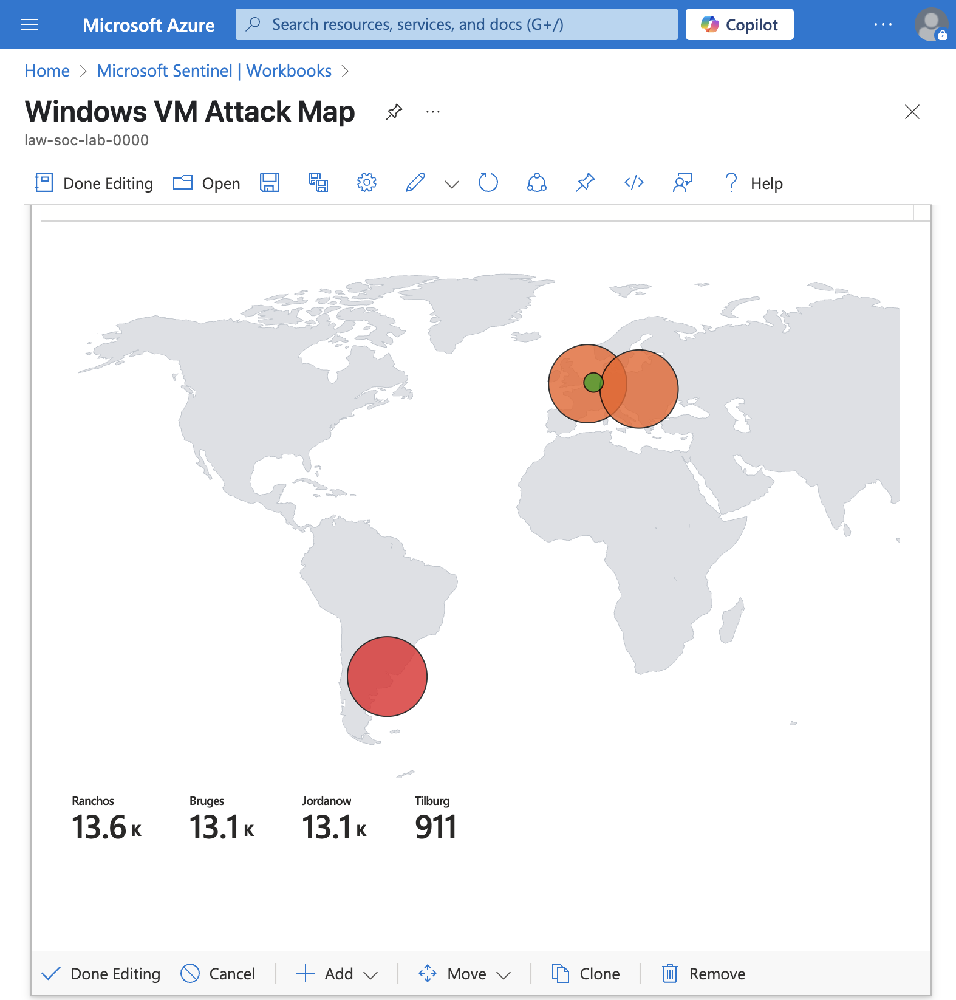

# Azure Honeypot Lab – Cybersecurity Logging & Detection

This project followed a guided lab to deploy a Windows-based honeypot in Microsoft Azure, analyze security logs using Azure Sentinel and KQL, and create an attack map. My goal was to explore detection visualization techniques used in modern cloud SOC environments.

---

## Tools & Services Used

- Microsoft Azure (Virtual Machines, Network Security Groups)
- Windows 10 (target/honeypot)
- Azure Sentinel (SIEM)
- Log Analytics Workspace (LAW)
- Kusto Query Language (KQL)
- Watchlists (GeoIP enrichment)
- Event Viewer (Windows logs)

---

## Lab Summary

| Part 1 | Create honeypot VM and expose services |
| Part 2 | Observe failed login attempts and analyze raw Windows logs |
| Part 3 | Forward logs to Azure Sentinel and query using KQL |
| Part 4 | Enrich logs using a GeoIP watchlist |
| Part 5 | Visualize attacker location with an attack map |

Here is a visual representation of the lab:

---

## Part 1: Deploying the Honeypot VM

- Created a Resource Group in the cloud via Azure with the following:
    - Virtual Network
    - Windows 10 VM
    - Network Security Group
 
      
- Configured the Network Security Group (NSG) to allow all inbound traffic.

  
- Disabled the Windows Defender firewall within the Virtual Machine instance (`wf.msc` → Properties → Turn off all profiles):

---

## Part 2: Simulate & Observe Brute Force Logins

- Attempted local failed logins using fake user (e.g., `employee`).
- Opened **Event Viewer → Security logs**, filtered for:
  - Event ID `4625` (failed login attempts)

Windows Security Log with failed brute force attempts:

---

## Part 3: Log Forwarding & Sentinel Integration

- Created a **Log Analytics Workspace (LAW)** and added it to the Resource Group.
- Deployed **Azure Sentinel** and connected it to the LAW.
- Enabled the **“Windows Security Events via AMA”** data connector.
- Queried logs in Sentinel using KQL:

---

## Part 4: GeoIP Enrichment Using Watchlists

- Imported a CSV (`geoip-summarized.csv`) as a **Sentinel Watchlist**:
  - Name: `geoip`
  - Search key: `network`

Applied `ipv4_lookup()` on attacker IPs to derive location data:

---

## Part 5: Attack Map Visualization

- Created a custom **Sentinel Workbook**
- Deleted default visualizations and added a **Query + Map** element.
- Imported JSON from `map.json` to visualize attacker IP geolocation.

---

## Key Takeaways

- Built a honeypot in Azure and simulated credential attacks.
- Used **Event Viewer** and **Azure Sentinel** to detect and visualize events.
- Learned basic **KQL queries** for event filtering.
- Enriched raw logs with external data (GeoIP) using **Watchlists**.
- Visualized common brute force attack origin points using **Sentinel Workbooks**.

